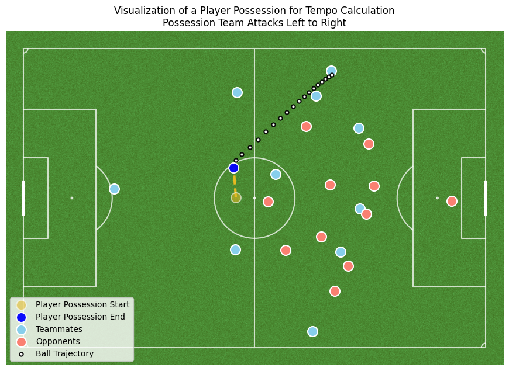
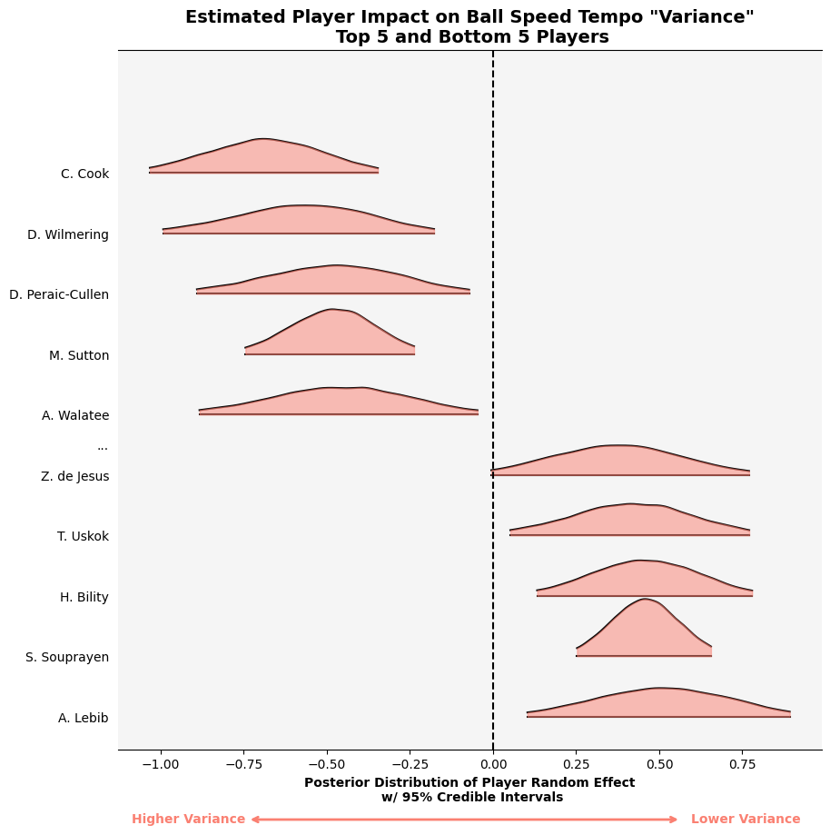

# Tempo Flexibility: A Player-Adjusted Bayesian Hierarchical Model for Evaluating Player Ball-Tempo Variability in Football (Soccer)

Author: Tahmeed Tureen <<tureen@umich.edu>>

Affiliation: Independent Researcher

⚠️ "This is ~~Football~~ Research Heritage" - ~~Jose Mourinho~~ Tahmeed Tureen ⚠️

---

## Set Up Environment

Python **3** is required. Please make sure you have ```pip``` installed so that you can install all of the relevant packages for this repo. 
**Note:** I prefer to use Python 3.12, but Python3+ should suffice. Please try Python 3.12 first.

### Create & Activate Virtual Environment

We recommend that you create a clean new virtual environment to prevent any conflicts

#### Mac

Open terminal and run the following set of commands:

```bash
python3 -m venv venv

# specify version (I prefer to work with Python 3.12)
python3.12 -m venv venv
```

Activate the environment

```bash
source venv/bin/activate
```

#### Windows
Open the Command Prompt and run the following set of commands:

```bash
python -m venv .venv

# specify version (I prefer to work with Python 3.12)
py -3.12 -m venv .venv
```

```bash
.venv\Scripts\activate.bat
```

### Install Requirements

```bash
pip install -r requirements.txt
```

You should now have a virtual environment that will let you run all of the code in `submission.ipynb`.

## Research Track Abstract
#### Introduction
Pep Guardiola’s tactical philosophy has evolved from emphasizing possession-driven tempo control to advocating adaptive, rhythm-responsive play. As he stated in January 2025: “Today, modern football is the way Bournemouth, Newcastle, Brighton, and Liverpool play. Modern football is not positional. You have to rise to the rhythm.” [[1](https://www.nytimes.com/athletic/6623652/2025/09/26/tempo-in-football-analysis/)] This perspective highlights a key tactical insight: elite performance may depend less on playing fast or slow and more on a player’s ability to flexibly adjust tempo in response to game context. Motivated by this, we propose a novel Bayesian hierarchical modeling framework to quantify individual differences in ball-tempo variability. Our goal is to identify players who demonstrate high tempo flexibility versus those whose in-game tempo is rigid.

#### Methods
We define Ball Speed Tempo (BST) as the distance the ball travels during a possession divided by the possession time measured using SkillCorner tracking data. Here, distance captures every metre (all directions) the ball moves during a player’s carry and subsequent pass until reception by a teammate, while possession time is the total number of frames for the carry and pass, converted to seconds (1 frame = 0.1 s). If a possession ends in a turnover or unsuccessful pass, distance and time only include the carry. This metric allows precise, frame-level quantification of in-game tempo.

We modeled BST using a Bayesian Hierarchical Gamma regression, adjusting for the multiple possessions per player in the data. The mean ($\mu$) and shape ($\alpha$) parameters were modeled hierarchically with player random effects. Predictors included: team phase of play, game state, separation from the nearest defender, and number of passing options. The shape parameter, inversely proportional to variance, serves as the primary measure of a player’s tempo flexibility—lower shape values indicate higher variability, higher values indicate rigidity.



#### Results
Model results identified key predictors influencing BST. More off-ball runs increased tempo by ~2%, while the “Finish” phase of play reduced tempo by ~12% relative to “Build Up.”

Player rankings based on posterior estimates of the shape parameter revealed the most flexible and rigid players in the Australian A-League:

- Flexible tempo players: Matt Sutton (GK, Melbourne City FC), Nishan Velupillay (W, Melbourne Victory), Douglas Costa (W, Sydney FC). Negative shape random effects indicate higher in-game tempo variability.

- Rigid tempo players: Andriano Lebib (CB, Perth Glory), Samuel Souprayen (CB, Melbourne City), Hosine Bility (CB, Brisbane Roar). Positive shape random effects indicate lower tempo variability.



#### Conclusion

We introduce a statistically robust framework for modeling player-specific ball-tempo variability, allowing analysts to identify players who are uniquely flexible or rigid in controlling tempo. Unlike most sports analytics studies that focus on mean effects, our model emphasizes variance, offering a novel perspective for scouting, tactical planning, and player development. This methodology aims to help teams “rise to the rhythm” of modern football, as Guardiola advocates, and provides a variance-focused lens rarely seen in sports analytics research.